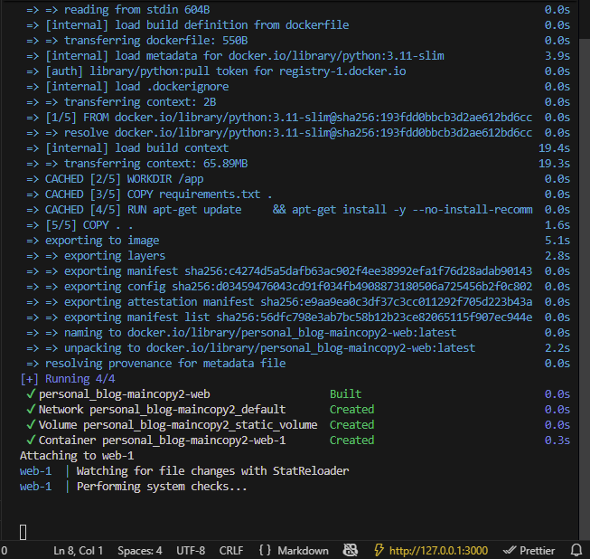
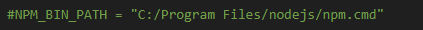

primero virtualizamos el entorno con python -m venv venv .
instalamos todo las dependencias con pip install -r requirements.txt
si no tiene pues los instalamos lo basico como pip install django

luego dockerizamos y para eso creamos:

dockerfile y docker-compose.

despues de haber puesto todo hacemos el
docker build -t personal_blog .

antes de eso creamos el requirement.txt pip freeze > requirements.txt
para crear el contenedor:: docker compose up --build

# COMPOSE---PROD-STAGE-1
# COMPOSE---PROD-STAGE-1
# COMPOSE---PROD-STAGE-1
# COMPOSE---PROD-STAGE-1
