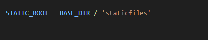
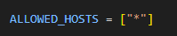
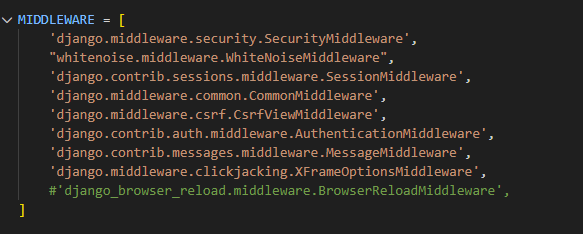
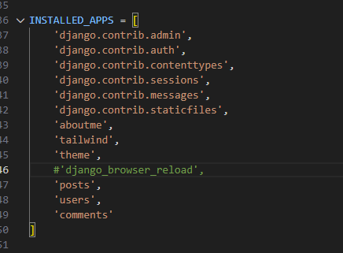
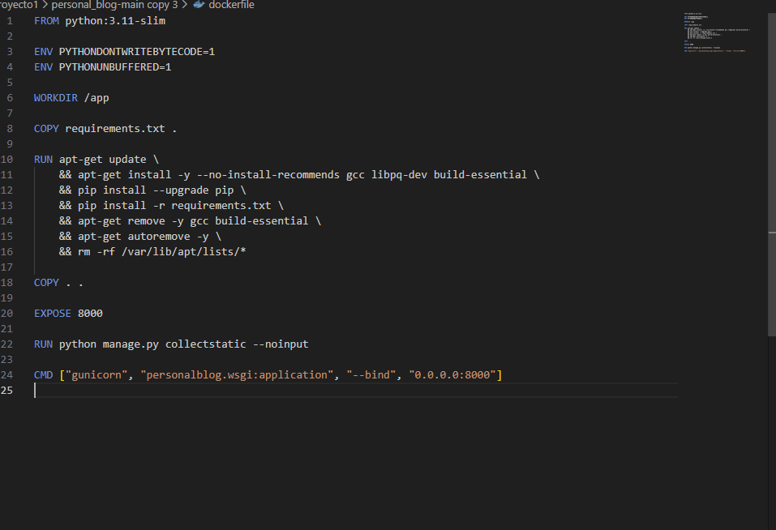
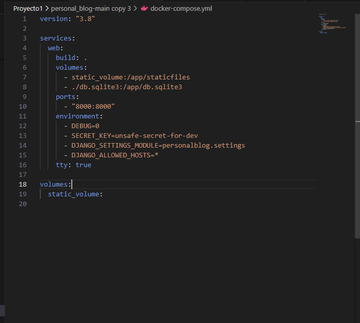
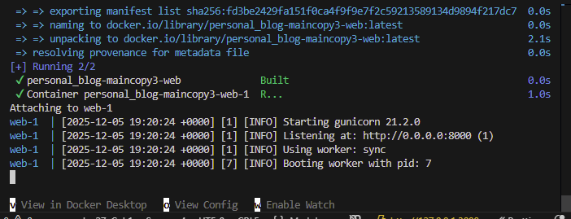

prod stage 1

1.Modificamos el requirements.txt para que tenga el gunicorn para un servidor mejor  y apra producion y whitenoise para los estilos que funcionene en modo de producion y borramos el del reload browser

2.Para que todo esto funcione deberiamos ir a nuestro settings.py y modificar un par de cosas:
-1.seria  borrar o poner como monetarios esta linea (NPM_BIN_PATH = "C:/Program Files/nodejs/npm.cmd")  porque si dejamos esta linea el docker intentara buscar dicho archivo y fallara ya que es linux.

3.Agregamos en el STATIC_ROOT deberiamos agregar esto al final del settings.py para que  funcione el  comando collectstatic y de por si el gunicorn 

4.Pon  esto ALLOWED_HOSTS = ["*"] en el allowed host  suele dar problemas de conexion asique lo cambiamos por si acaso  

5.Por ultimos colocamos esto en el MIDDLEWARE ("whitenoise.middleware.WhiteNoiseMiddleware") para que el whitenoise funcione correctamente y nuestros estilos se cargue n correctamente y borramos el  que esta en verde el que hace que la pagina se recargue

6.En instaled app quitamos  el siguiente   django_browser_reload

7.Modificamos nuestro dockerfile para que quede tal que asi 

8.Modificamos el docker-compose.yaml para qeu quede tal qeu asi 

10.Hacemos el build con docker-compose up --build y si todo a estado bien veremos que nos sale esto 
